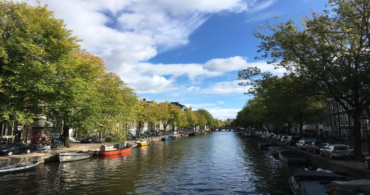
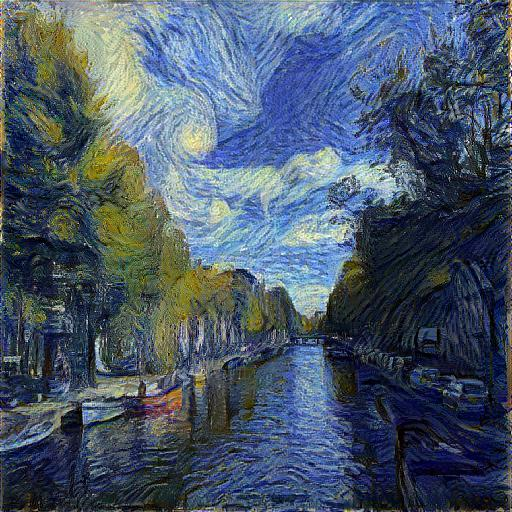
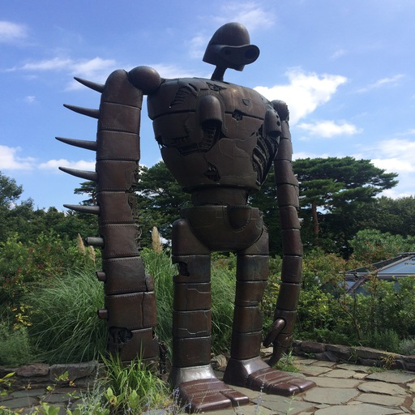
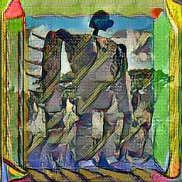

# neural-style

This is another implementation of style transfer in pytorch. I build this project for learning purpose of pytorch and hopefully it can help you a little bit. This code is based on the paper [1] and [2]. In [1], the gradient is applied in the image itself, so it will take thousands of iterations to get the stylized image. However, in [2], model can be trained for each style and it only take a little time to get the stylized image in inference stage.

Both methods are supported.

## How to start

### Download the pre-trained models
I use the `VGG16` and `VGG19` as the pre-trained models, which can be downlad [here](https://github.com/jcjohnson/pytorch-vgg). The model is trained in Caffe style, that is, with BGR format in the range [0, 255]. Better to subtract mean [103.939, 116.779, 123.68] before feeding into the network.

### Download the dataset
To run the method in the paper [2], you should use extra images. I recommend the [coco dataset](http://mscoco.org/dataset/), which is used in the paper. It contains more than 8000 images. 

### Train the model
Here is the example of train the fast verion of style transfer

	export CUDA_VISIBLE_DEVICES=0
	python ./neural-style/fast.py \
	  --style-image="./images/themuse.jpg" \
	  --content-image="./images/robot.jpg" \
	  --loss-style=5 \
	  --loss-feature=1 \
	  --loss-interval=100 \
	  --pretrained-model="./models/vgg16-00b39a1b-255.pth" \
	  --use-cuda \
	  --styled-prefix="fast" \
	  --snapshot-prefix="fast" \
	  --snapshot-interval=5000 \
	  --styled-interval=100 \
	  --epoch=4 \
	  --lr=0.001 \
	  --size="256,256" \
	  --batch-size=4 \
	  --dataset="/path/to/dataset/coco/" 2>&1 | tee fast.log

## Fancy results

  
  
  
  
   

  
  
  

The first row is trained based on the paper [1], it goes through 40000 iterations. The second row is trained base on paper [2] for 20000 iterations, with batch size 4.

## Reference
[1]: Image Style Transfer Using Convolutional Neural Networks

[2]: Perceptual Losses for Real-Time Style Transfer and Super-Resolution

## License
MIT
